# Anansi — Open Source AI Operations Assistant for Mini-Grids

In Akan folklore, Anansi the spider tricked the sky-god into giving him every story in the world, then wove them into a single web so people could share them. This Anansi does the same thing for mini-grid operators, sans trickery — weaving the scattered threads of daily work (meters, maps, tickets, field conversations, tribal knowledge in Telegram groups) into one chat thread your team and customers can actually talk to.

Built and run in production by [NXT Grid](https://nxtgrid.co), open-sourced for the wider energy-access community.

The admin app displays the public name Mini-Grids Assistant on the login screen and in UI copy as of PR #115 (2026-08-20); the codebase and repo remain named Anansi.

## The outer boundary

Everything below is one DigitalOcean App Platform app. This section is the map of what crosses its edges — what can call in, what it calls out to, and where state actually lives. Most of the subtle bugs in this repo have come from getting one of these boundaries wrong, so it's worth reading before changing anything that touches routing, auth, or persistence.

### Ingress — what can call in

A single hostname fronts three services, split by path prefix. Rules are evaluated **in order**, and the last one is a catch-all, so a new path that doesn't match an earlier rule silently lands on the admin app (usually appearing as its login page rather than an error).

| Path prefix | Service | Prefix forwarded? | What it's for |
|---|---|---|---|
| `/chat` | chat-orchestrator | **preserved** | Telegram webhook + `/chat/notify` external alert passthrough |
| `/mini-app` | chat-orchestrator | **preserved** | Telegram Mini App UI |
| `/api/mini-app` | chat-orchestrator | **preserved** | Mini App backend calls |
| `/webhook` | chat-orchestrator | **preserved** | Inbound Jira webhooks |
| `/mcp-gateway` | mcp-gateway | **stripped** | MCP endpoint + its OAuth routes (see [MCP gateway](#mcp-gateway) below) |
| `/.well-known/oauth-*/mcp-gateway` | mcp-gateway | **preserved** | RFC 8414/9728 OAuth discovery |
| `/` | anansi-app | stripped | NiceGUI admin UI (catch-all) |

**`preserve_path_prefix` is not cosmetic.** DigitalOcean strips the matched prefix before forwarding unless it's set. Whether you want it depends entirely on whether the *service's own routes* include the prefix: chat-orchestrator serves real `/chat/...` routes so it needs the prefix preserved, while the gateway serves bare `/mcp`, `/healthz`, `/oauth/...` so it needs it stripped. Getting this backwards produces a 404 on every request, or a redirect to a URL missing the prefix entirely.

### Data stores — two databases, and they are not interchangeable

| Store | Access | Writeable? | Holds |
|---|---|---|---|
| **Auth DB** (`AUTH_DB_*`) | direct Postgres (asyncpg, pooler port) | **read-only** | `public.accounts`, `grids`, `organizations`, `dcus` — the operational/grid records that drive permissions |
| **Chat DB** (`CHAT_DB_URL` + `CHAT_DB_SERVICE_KEY`, also `CHAT_DB_POSTGRES_URL`) | Supabase / PostgREST | writeable | conversations, RAG chunks, prompts, skills, escalations, and anything this repo migrates |
| **Timescale** (`TIMESCALE_*`) | direct Postgres | reads | time-series telemetry |
| **DO Spaces** (`DO_SPACES_*`) | S3 API | writeable | object storage |

Two rules follow from this and are easy to get wrong:

- **`db/migrations/` targets the Chat DB only.** Anything needing a new table must live there, because the Auth DB is read-only to this app — a feature that writes to `AUTH_DB_*` cannot work, no matter how the connection is configured.
- **Merging a migration does not apply it.** Someone with Chat DB access runs it separately. An unapplied migration usually fails at runtime as `UndefinedTableError`, not at deploy time.

### Egress — what this repo calls out to

Grouped by what they're for; each is gated by its own env vars and most by an `*_ENABLED` flag.

- **LLMs** — Gemini (`GEMINI_*`, `MODEL_THINKING`/`FAST`/`LITE`), OpenRouter as an alternate provider, Langfuse for tracing
- **Google Workspace** — OAuth sign-in (`AUTH_CLIENT_ID`/`SECRET`), plus Docs/Drive/Sheets via a service account (`GOOGLE_SERVICE_ACCOUNT_JSON`, `*_DOC_ID`) and an Apps Script helper (`ANANSI_HELPER_*`)
- **Field/grid systems** — VRM (`VRM_TOKEN`, MQTT), ChirpStack, Calin v1/v2, metering and Tiamat APIs
- **Ops tooling** — Jira (tickets + webhooks), Grafana (dashboards), Loki (logs), GitHub (`GITHUB_TOKEN`, codebase search), Tavily (web search)
- **Messaging** — Telegram bot API
- **Payments** — payment processor (`PAYMENT_PROCESSOR_*`)

Each of these is reachable to the assistant as an MCP server under [`mcp_servers/servers/`](mcp_servers/servers/); the gateway's [`tiers.py`](mcp_servers/gateway/tiers.py) decides which are exposed to external MCP clients and which never are.

## What it does for mini-grid operators

### Customer support automation for prepaid meters

Customers message the bot to check balance, buy tokens, report no-power, or get a token resent. Staff use the same bot to commission new meters, unassign them, change power limits, and resolve disputes. Anansi talks to your meter backend (Metering Platform by default, swappable via MCP) and applies the right approval rules depending on whether the requester is a customer or a staff member.

<table>
  <tr>
    <td align="center"><a href="docs/illustrations/meterIssue.jpeg">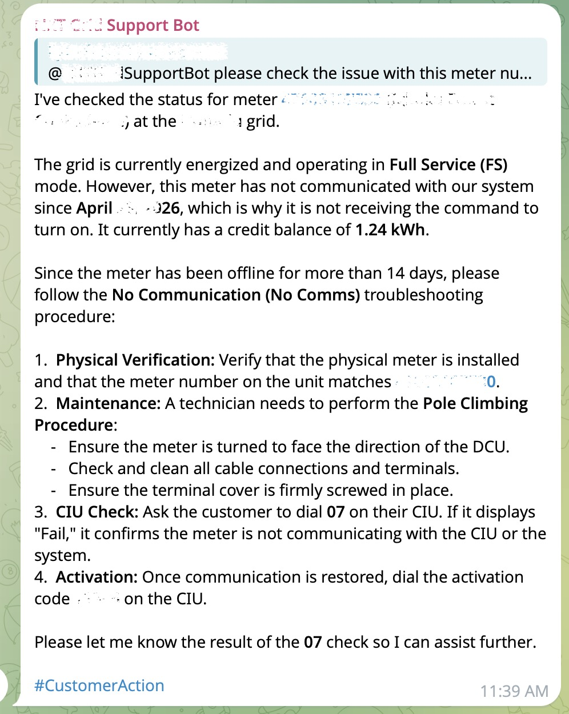</a><br/><sub>Customer reports a meter issue</sub></td>
    <td align="center"><a href="docs/illustrations/resolved.jpeg">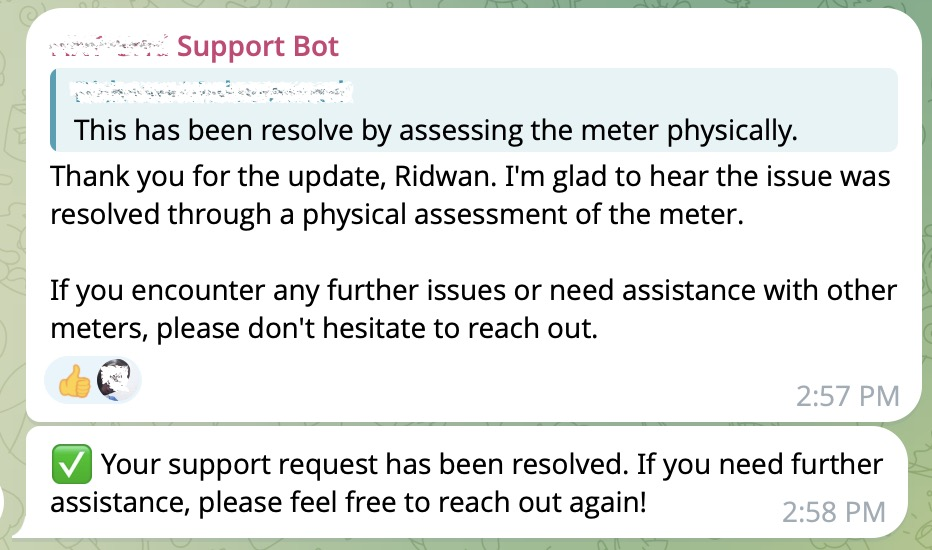</a><br/><sub>Issue resolved end-to-end</sub></td>
  </tr>
</table>

### Geospatial design & site planning

The `/lpp` expert generates a Light Preliminary Package for a candidate site. Give it a GPS point and a site name; it pulls the community boundary from the GRID3 Nigeria settlement-extents dataset, runs the layout engine to place poles and lines, renders a map, and drafts a Google Doc package. The output is structured so the design can feed directly into a downstream Bill-of-Materials tool without re-keying.

<table>
  <tr>
    <td align="center"><a href="docs/illustrations/siteSelection.jpeg">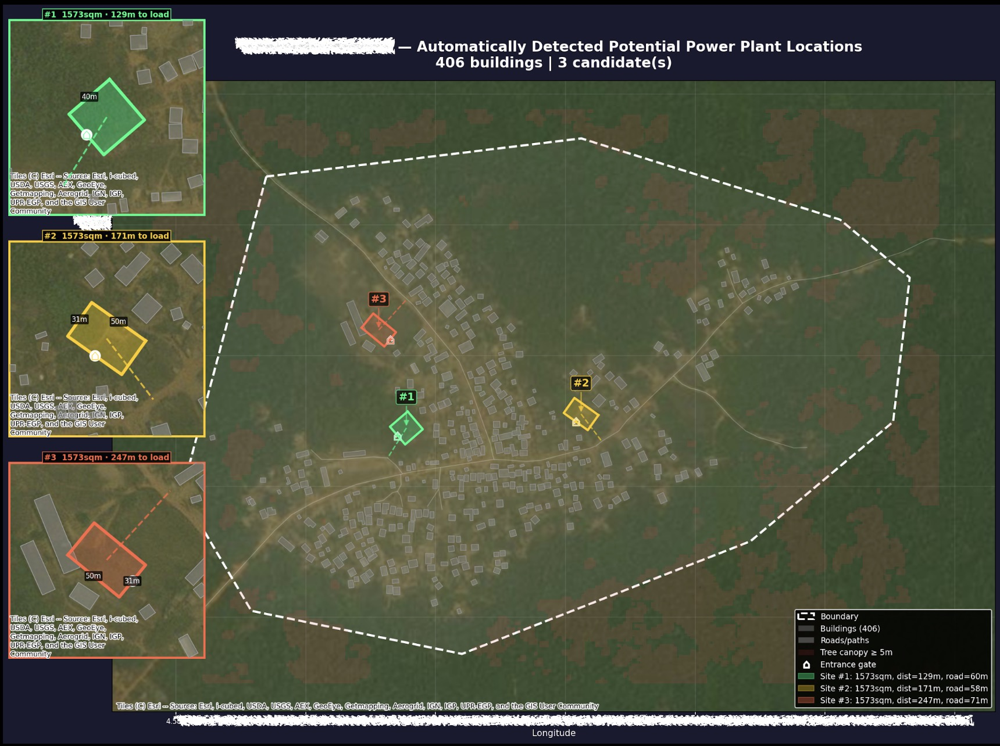</a><br/><sub>Site selection &amp; community boundary</sub></td>
    <td align="center"><a href="docs/illustrations/distrib.jpeg">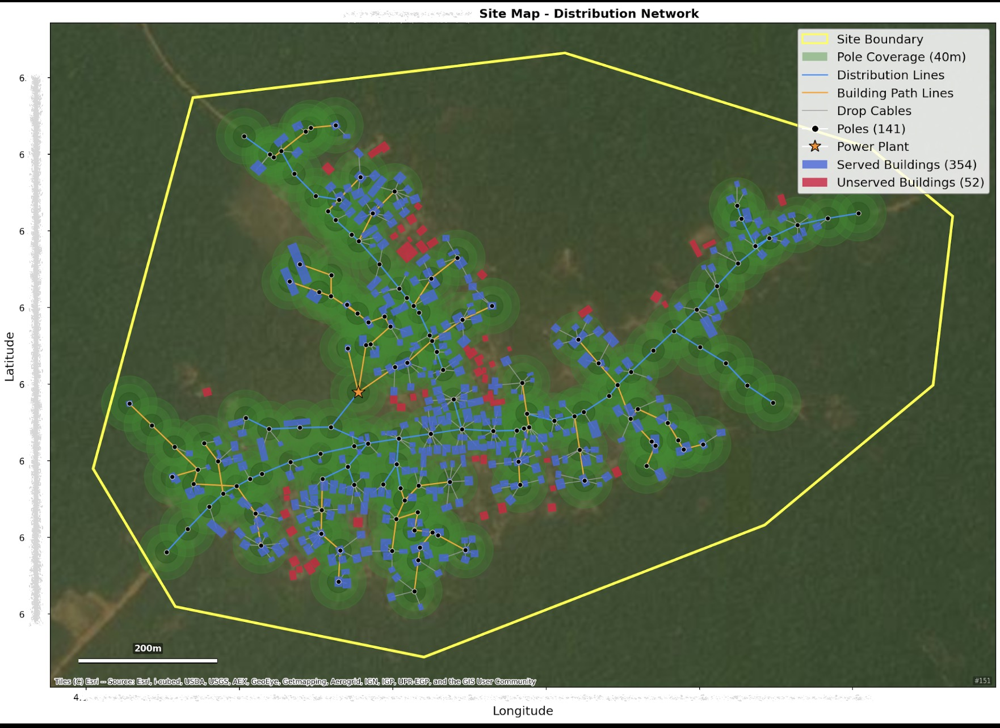</a><br/><sub>Generated distribution layout</sub></td>
    <td align="center"><a href="docs/illustrations/powerHeatMap.png">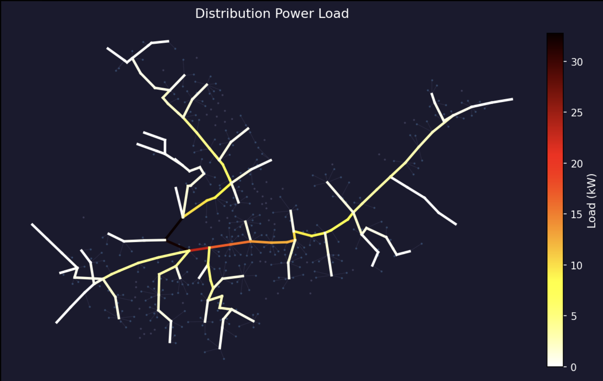</a><br/><sub>Power demand heat map</sub></td>
  </tr>
</table>

#### Power plant site layout

For the generation side, Anansi renders the power-plant footprint itself: PV array blocks with plinths, earth pits, lightning-arrester coverage circles, DC and AC cable runs with lengths, the Victron cabin, feeder pillar, VSAT, and the fenced site boundary with a gate. Module count, achieved vs target kWp, and cable lengths (including contingency) are summarised in the title block, so the same image doubles as a quick BoM sanity-check.

<table>
  <tr>
    <td align="center"><a href="docs/illustrations/powerPlantLayout.png">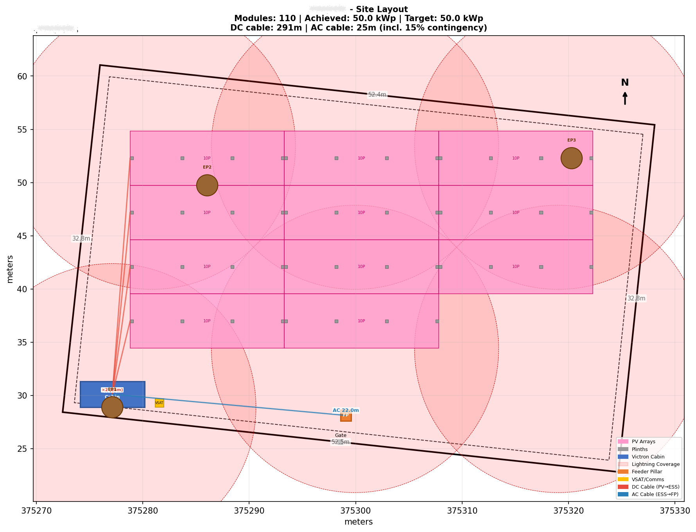</a><br/><sub>PV arrays, earth pits, lightning coverage, cable trenches &amp; cabin</sub></td>
  </tr>
</table>

### Grid analytics & KPIs on demand

`/analyze`, `/kpi`, and `/report` let staff ask "how did Site X perform last week?" in plain English. Anansi pulls from TimescaleDB, the Victron VRM API (solar inverter telemetry), and your operational DB, then returns charts plus a written summary. Reports can be scheduled — e.g. every Monday at 9am to a specific Telegram group.

<table>
  <tr>
    <td align="center"><a href="docs/illustrations/grid.jpeg">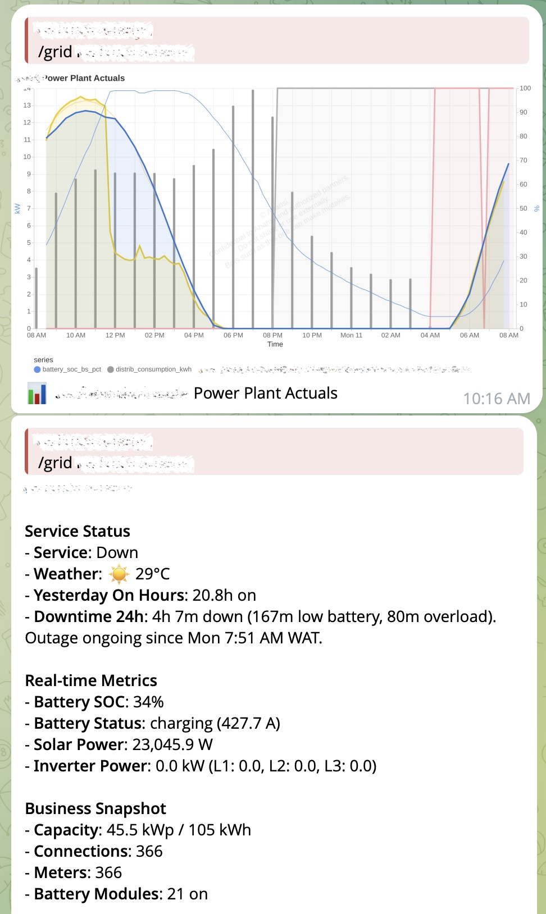</a><br/><sub>Single-grid status report</sub></td>
    <td align="center"><a href="docs/illustrations/grids.jpeg">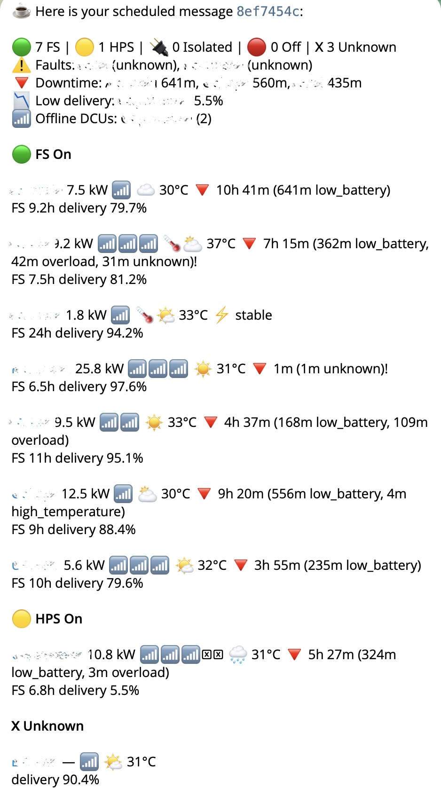</a><br/><sub>Multi-grid KPI overview</sub></td>
    <td align="center"><a href="docs/illustrations/gridIssue.jpeg">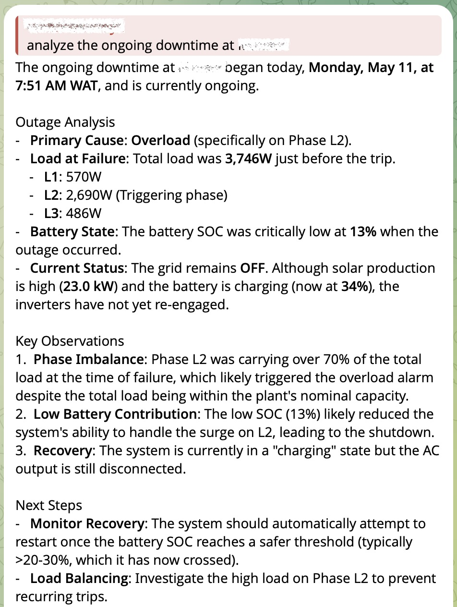</a><br/><sub>Grid issue diagnosis</sub></td>
  </tr>
</table>

### Ticketing, escalation, and institutional memory

Conversations that need a human are routed to the right internal Telegram group automatically, and tracked as a ticket with the full transcript attached — as a JIRA issue when Jira is configured and healthy, or in an internal ledger when it isn't, so escalations keep working (and stay recoverable) with or without Jira. The same pipeline ingests your historical Telegram support chats, Google Drive docs, and GitHub repos into a GraphRAG index — so the bot answers from your actual past decisions, not generic LLM knowledge.

<table>
  <tr>
    <td align="center"><a href="docs/illustrations/tracking.jpeg">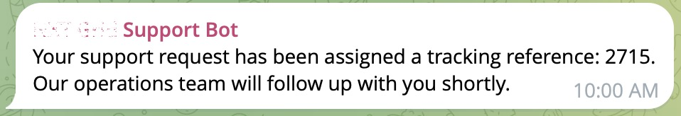</a><br/><sub>Escalation tracking</sub></td>
    <td align="center"><a href="docs/illustrations/meta.jpg">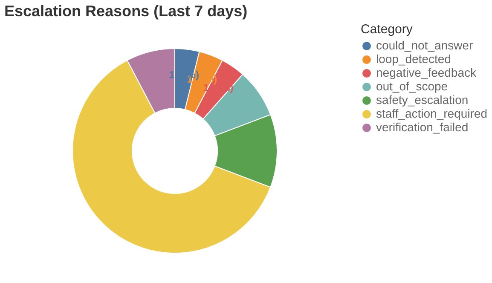</a><br/><sub>Bot performance &amp; escalation analytics</sub></td>
  </tr>
</table>

### Skills: operator-authored automations

Skills are multi-step automations that operators author by having a normal conversation with the bot through the admin app's builder UI, with no code or prompt engineering required. Each message becomes one step, and steps can be LLM instructions or pre-built function calls, so existing tool calls can be composed into a flow alongside prose instructions. Saved Skills can be scheduled (recurring or one-off) and run unattended end-to-end with no operator present to resume or confirm mid-run. Skills are the user-buildable counterpart to the hardcoded Expert Subagents, which handle workflows where step ordering is enforced in code.

### Context: curated and attached knowledge

Everything the bot is told directly — not generated by the model, not retrieved by RAG — lives on one admin page, grouped by where it comes from. **Built-in** modules (who's in a grid, the knowledge graph, episodic memory) are generated by the code per request; you choose which prompts use them, but can't edit their content. **Curated** modules are typed straight into the admin UI — this app is the source of truth. **External** modules attach a Google Doc or Sheet: the content stays in Drive, fetched fresh on every request and filtered to who's asking, so a procedures doc your ops team already maintains stays current with zero duplication. Every module is scoped (everywhere, or one organization) and, for an attached document, has an explicit audience — mirror the document's own sharing, or publish it to everyone the prompt serves — so a scoping mistake fails loudly instead of quietly leaking, or quietly omitting, content. A module isn't limited to prompts either: the same picker lives on a skill's own Context card in the Workflows editor, so a skill's steps can draw on the exact same curated knowledge a prompt does, resolved fresh at the start of each run. That includes generative prompts, not just conversational ones — pin a house-style guide to `doc_editing.edit_highlighted` and every `@anansi-chatbot` comment or chat instruction that edits a Google Doc inlines it. Scope still applies: a site- or organization-scoped module only reaches an edit whose caller resolved that grid or organization (an expert-workflow edit does; a raw chat edit today does not, so pin `global` modules there).

<table>
  <tr>
    <td align="center"><a href="docs/illustrations/contextModuleGroups.png">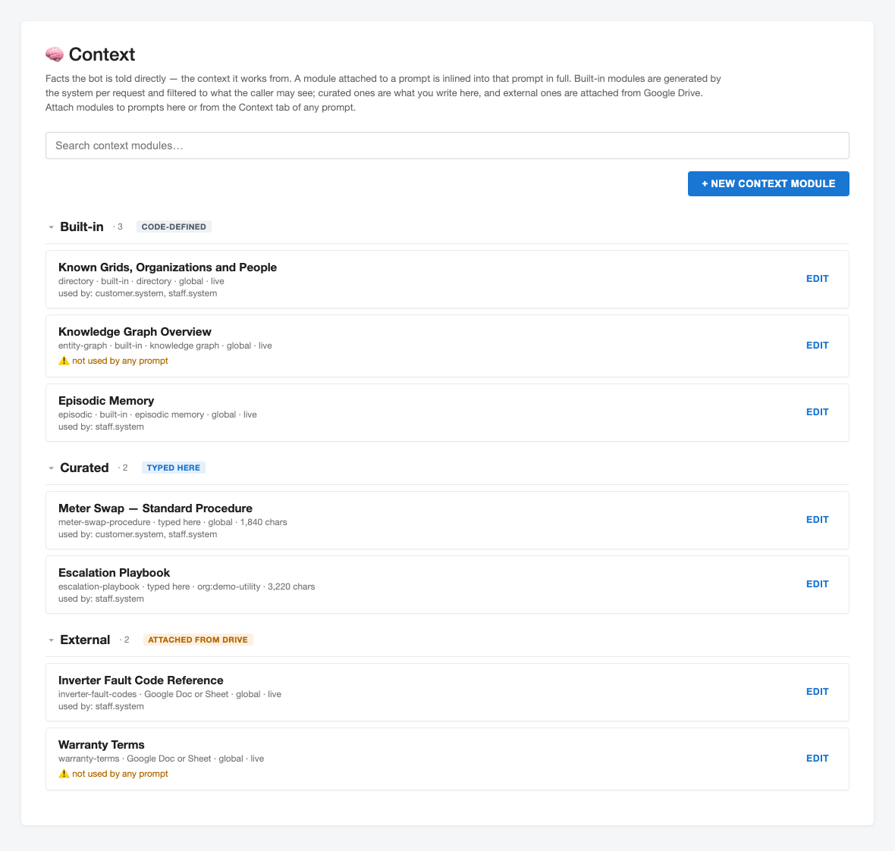</a><br/><sub>Built-in, Curated, External — grouped by who's the source of truth</sub></td>
    <td align="center"><a href="docs/illustrations/contextModuleDialog.png">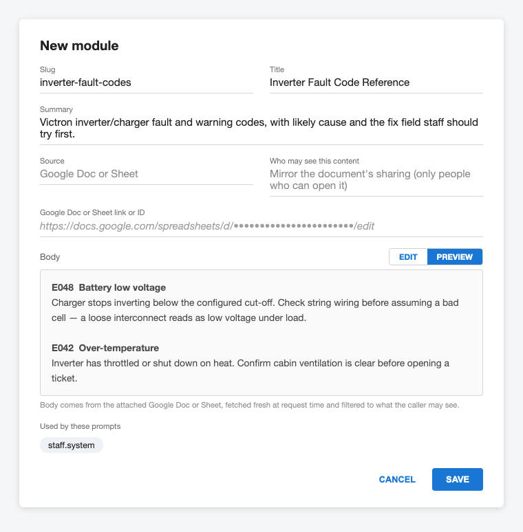</a><br/><sub>Attaching a Doc — live preview, access checked against your own Drive permissions</sub></td>
  </tr>
</table>

## Why "general-purpose underneath" matters

Anansi is a provider-aware LLM chat orchestrator at its core — MCP tools, RAG, expert workflows, and a generative layer meant to be reshaped by the people running it, not just the people who built it. Three admin-app surfaces do that reshaping, live, with no redeploy and no code change: **prompts** (what the bot is instructed to do — your ops team edits any prompt in place; a bundled default always ships with the code, and a Google Doc can still be attached per prompt for teams that prefer editing there), **context modules** (what it's told as fact — see [Context](#context-curated-and-attached-knowledge) above; a module can attach to a prompt or to a skill), and **Skills** (multi-step automations it can run — see [Skills](#skills-operator-authored-automations) above). That's the surface area ops and leadership actually touch to change what the bot does and knows; the sections below are for the engineers keeping the surface itself running. Gemini remains the default generation provider, and the shared LLM gateway can also be pointed at OpenRouter for OpenAI-style chat completions. The mini-grid focus comes from the *tools and embellishments* layered on top, and from the "messenger-first" assumption that field staff and customers live in chat apps, not dashboards. Telegram is the primary surface today; WhatsApp is on the roadmap but not yet supported.

**Project structure:**
- `chat_orchestrator/` - Main chat orchestration service; Gemini is the default provider
- `mcp_servers/` - MCP tool servers (grid design, meters, equipment control/diagnostics, JIRA, Grafana, payments, solar, knowledge, reference, and more — see [MCP Servers](#3-mcp-servers) below)
- `rag_pipeline/` - Knowledge ingestion from GitHub, Google Drive, Telegram
- `shared/prompts/` - The prompt library: bundled defaults, DB overrides, Google Doc attachments, and tagged knowledge modules composed into prompt context
- `shared/` - Common utilities (auth, database, logging, Google Docs fetching, provider-neutral LLM gateways)
- `anansi_app/` - NiceGUI admin UI for chat history, broadcasts, grid design, Skills, and settings
- `mini_app/` - Vite customer chat widget embedded in operator portals
- `llms.txt` - Short repo map for LLM-assisted setup and onboarding. Keep it in sync when README setup, provider configuration, or major component paths change.

## Quick Start

### Prerequisites

- Python 3.11+
- Google AI Studio or Gemini API key for the default provider ([Get one](https://aistudio.google.com/apikey))
- Optional OpenRouter API key if you want to exercise the shared OpenRouter generation gateway
- Google Cloud service account with Docs API enabled
- Supabase account

### 1. Setup Google Service Account

```bash
# Create service account and enable APIs
# See: https://console.cloud.google.com/iam-admin/serviceaccounts

# Enable these APIs:
# - Google Docs API
# - Google Drive API

# Download credentials JSON
```

### 2. Prompts — bundled by default, editable without a redeploy

Every prompt Anansi sends to a model — customer instructions, staff instructions, expert definitions, and about twenty smaller prompts used by individual workflows — lives in `shared/prompts/library/*.prompt` and ships with the code. A fresh clone works immediately with these generic defaults; nothing in this step is required to get started.

To customize for your organization, sign in to the admin app and open **Prompts** (`/prompts`). Pick an overridable prompt (most are; a handful of policy/routing prompts are locked and shipped-only by design — see the prompt's own detail view), edit its body, and either save a draft or publish it live. Changes take effect within about a minute, no redeploy.

If your team prefers editing in a Google Doc instead of the in-app editor, you can still attach one per prompt — the doc becomes that prompt's live source, with the bundled file as the fallback if the doc becomes unreachable. This is optional; the in-app Prompts page is now the primary way to edit.

**If you do attach a Google Doc**, give it this structure so section parsing works:
```
[Optional title page]

[PAGE BREAK]

Heading 1: System Instructions
You are a helpful assistant for [Company Name].
Be professional, empathetic, and accurate.

Heading 1: QnA Knowledge Base
Q: What are your business hours?
A: Monday-Friday, 9 AM - 5 PM EST.

Heading 1: Example Conversations
User: I can't log in
Assistant: I understand that's frustrating. Let me help...
```

**Share the doc with your service account:**
- Get the service account email from the credentials JSON: `"client_email": "..."`
- Share the doc with Viewer access

### 3. Install and Configure

```bash
# Clone and setup shared utilities
git clone <repository-url>
cd anansi
./setup_shared.sh

# Chat Orchestrator
cd chat_orchestrator
python3 -m venv .venv
source .venv/bin/activate
pip install -e .[dev]

# Install pre-commit hooks (code quality checks on every commit)
pre-commit install

# Configure environment
cp .env.example .env
```

**Edit `.env`:**
```bash
# Required
LLM_PROVIDER=gemini
GOOGLE_API_KEY=your-gemini-api-key
GOOGLE_SERVICE_ACCOUNT_JSON='{"type":"service_account",...}'  # only needed if you attach Google Docs to prompts

# Optional — only if attaching a Google Doc to customer.system / staff.system
# instead of editing them from the Prompts admin page (see step 2 above)
CUSTOMER_SUPPORT_DOC_ID=1abc123xyz456  # From GDoc URL
STAFF_SUPPORT_DOC_ID=1def789uvw012     # From GDoc URL

# Who may edit/publish prompts from the Prompts admin page (comma-separated
# emails). All three are optional; unset means nobody can edit anything —
# the bot still runs fine on bundled defaults.
PROMPT_EDITORS_OPS=ops@example.com
PROMPT_EDITORS_ENG=eng@example.com
PROMPT_ADMINS=admin@example.com

# Chat Database (for conversations and RAG)
CHAT_DB_URL=https://your-project.supabase.co
CHAT_DB_SERVICE_KEY=your-service-role-key

# Auth Database (read-only for user lookup)
AUTH_DB_DIRECT_CONNECTION=true
AUTH_DB_HOST=db.your-auth-project.supabase.co
AUTH_DB_PORT=6543
AUTH_DB_NAME=postgres
AUTH_DB_USER=readonly_user
AUTH_DB_PASSWORD=your_password
AUTH_DB_SSL_MODE=require

# Gemini Config
# MODEL_THINKING/MODEL_FAST/MODEL_LITE are required -- each prompt declares
# which of the 3 tiers it uses (shared/llm/model_tiers.py), and resolving an
# unset tier raises rather than silently falling back.
MODEL_THINKING=gemini-pro-latest
MODEL_FAST=gemini-flash-latest
MODEL_LITE=gemini-2.5-flash-lite
FALLBACK_MODEL=gemini-2.5-flash-lite
GEMINI_TEMPERATURE=0.7

# OpenRouter compatibility (optional; keep LLM_PROVIDER=gemini unless testing it)
# LLM_PROVIDER=openrouter
# OPENROUTER_API_KEY=your-openrouter-api-key
# OPEN_ROUTER_BEARER_TOKEN is also accepted as a local alias
# OPENROUTER_MODEL=google/gemini-2.5-flash
# OPENROUTER_PROVIDER_ORDER=google-vertex
# OPENROUTER_ALLOW_FALLBACKS=false
# OPENROUTER_HTTP_REFERER=https://yourapp.example.com
# OPENROUTER_APP_TITLE=Anansi
```

### 4. Run

```bash
# Development (all services)
./dev.sh

# Or orchestrator only
cd chat_orchestrator && source .venv/bin/activate
uvicorn orchestrator.api.app:app --host 0.0.0.0 --port 8000 --reload

# Test endpoint
curl http://localhost:8000/health
```

## Customizing for Your Deployment

After the basic setup works, these are the things every operator should configure before going live:

### Staff organization ID

`STAFF_ORG_ID` controls which `organization_id` in your `accounts` table gets staff-mode access (full tools, staff instructions). The default is `2` — change it to match your own database:

```bash
STAFF_ORG_ID=5   # whatever your staff org's ID is in the accounts table
```

Staff users see the `STAFF_SUPPORT_DOC_ID` instructions and have access to all MCP tools. Everyone else gets `CUSTOMER_SUPPORT_DOC_ID` and a limited tool set.

### Bot username

Set your Telegram bot's @handle so group-chat mention detection works correctly:

```bash
TELEGRAM_BOT_USERNAME=YourBotName   # without the @ prefix
```

Without this, the bot won't respond when mentioned by name in group chats.

### System instructions

The bundled prompts under `shared/prompts/library/*.prompt` (including `customer.system` and `staff.system`) are intentionally generic and will not reflect your organization's actual support process. For a real deployment, edit them from the **Prompts** admin page (`/prompts`) — no env vars required.

If you'd rather keep editing in Google Docs, the legacy doc-id env vars still work exactly as before and take precedence over the bundled default (though a DB override made from the Prompts page takes precedence over the doc, if you use both):

```bash
CUSTOMER_SUPPORT_DOC_ID=<your-customer-doc-id>
STAFF_SUPPORT_DOC_ID=<your-staff-doc-id>
EXPERT_INSTRUCTIONS_DOC_ID=<your-expert-doc-id>
```

### LLM provider selection

Gemini is the supported default:

```bash
LLM_PROVIDER=gemini
GOOGLE_API_KEY=your-gemini-api-key
MODEL_THINKING=gemini-pro-latest
MODEL_FAST=gemini-flash-latest
MODEL_LITE=gemini-2.5-flash-lite
```

The shared generation gateway can also call OpenRouter using OpenAI-compatible chat completions:

```bash
LLM_PROVIDER=openrouter
OPENROUTER_API_KEY=your-openrouter-api-key
# OPEN_ROUTER_BEARER_TOKEN is also accepted as a local alias
OPENROUTER_MODEL=google/gemini-2.5-flash
OPENROUTER_PROVIDER_ORDER=google-vertex
OPENROUTER_ALLOW_FALLBACKS=false
OPENROUTER_HTTP_REFERER=https://yourapp.example.com
OPENROUTER_APP_TITLE=Anansi
```

Keep `LLM_PROVIDER=gemini` for normal deployments until you intentionally test OpenRouter-backed generation paths. For OpenRouter BYOK/BYOL with Google Vertex, set `OPENROUTER_PROVIDER_ORDER=google-vertex` and `OPENROUTER_ALLOW_FALLBACKS=false` so requests do not fall back to other OpenRouter endpoints. The settings page discovers provider routes from the selected OpenRouter model using the normal OpenRouter access key. Gemini-specific orchestrator code remains available as the default backup path.

### Operator-specific database columns

The `shared/auth` code references a column named `is_generation_managed_by_nxt_grid` in the `grids` table (via the `MANAGED_GENERATION_COLUMN` env var, defaulting to that name). This is an operator-specific column from the reference deployment. If your schema uses a different name (or doesn't have this concept), set `MANAGED_GENERATION_COLUMN` or update the default in `shared/auth/auth_service.py`.

### MCP servers

Most MCP servers are disabled by default. Enable only what you have credentials for via the `{SERVER_NAME}_ENABLED` env vars. See `mcp_servers/.env.example` for the full list with documentation.

---

## How It Works

### Prompt Resolution & System Instructions Flow

Every prompt resolves through `shared.prompts.PROMPTS`, in this order — each layer optional, falling through to the next on any failure:

```
1. DB override (Prompts admin page) — only if the prompt is overridable
    ↓ (if none, or lookup fails)
2. Attached Google Doc — only if a doc id is configured for this prompt
    ↓ (if none, or fetch fails)
3. Bundled default (shared/prompts/library/<id>.prompt) — always present

For a Google Doc source, steps in between:
   a. Fetch via Docs API
   b. Convert to Markdown (Heading 1-6 → # to ######, Bold → **text**, Italic → *text*)
   c. Auto-strip title page, headers/footers, inline images

Whatever body wins resolution is then:
4. Parsed into sections by Heading 1 (per the prompt's declared `sections`)
5. Split: the named system-instructions section → systemInstruction field;
   everything else (QnA, Examples, and any composed knowledge modules) →
   first user message
6. Sent to Gemini API (default provider)

{
  "systemInstruction": {
    "parts": [{"text": "System Instructions section"}]
  },
  "contents": [
    {
      "role": "user",
      "parts": [{"text": "QnA + Examples + Technical Knowledge sections"}]
    },
    {
      "role": "user",
      "parts": [{"text": "Actual user question"}]
    }
  ]
}
```

Every render carries provenance (which prompt id, source, version, checksum produced it) into logs and, when `LANGFUSE_ENABLED=true`, the trace.

### Customer vs Staff Mode

**Determined by user's `organization_id`:**
- `organization_id = STAFF_ORG_ID` (env var, default `2`) → **Staff mode** (internal users)
  - Resolves the `staff.system` prompt
  - Access to all MCP tools
  - Full system capabilities

- All other `organization_id` values → **Customer mode** (external users)
  - Resolves the `customer.system` prompt
  - Limited to customer support tools
  - Safe, scoped responses

**Both modes use identical processing pipeline.**

## Architecture

### Request Flow

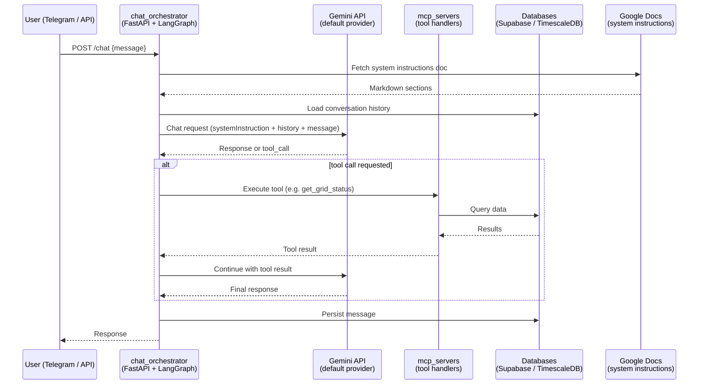
```mermaid
sequenceDiagram
    participant U as User (Telegram / API)
    participant O as chat_orchestrator<br/>(FastAPI + LangGraph)
    participant G as Gemini API<br/>(default provider)
    participant M as mcp_servers<br/>(tool handlers)
    participant DB as Databases<br/>(Supabase / TimescaleDB)
    participant GD as Google Docs<br/>(system instructions)

    U->>O: POST /chat {message}
    O->>GD: Fetch system instructions doc
    GD-->>O: Markdown sections
    O->>DB: Load conversation history
    O->>G: Chat request (systemInstruction + history + message)
    G-->>O: Response or tool_call
    alt tool call requested
        O->>M: Execute tool (e.g. get_grid_status)
        M->>DB: Query data
        DB-->>M: Results
        M-->>O: Tool result
        O->>G: Continue with tool result
        G-->>O: Final response
    end
    O->>DB: Persist message
    O-->>U: Response
```

### Service Map

```
Telegram / Web Client
        │
        ▼
┌───────────────────────┐
│   chat_orchestrator   │  FastAPI — main chat orchestration
│   (port 8000)         │  LangGraph stategraph, expert workflows,
│                       │  MCP tool execution
└───────┬───────────────┘
        │ Python imports (monorepo)
        ▼
┌───────────────────────┐
│     mcp_servers       │  MCP tool servers — JIRA, Grafana,
│                       │  customer data, equipment control,
│                       │  meters, schedule, payments, knowledge
└───────────────────────┘

┌───────────────────────┐
│    rag_pipeline       │  Document ingestion — GitHub, Google
│                       │  Drive, Telegram; GraphRAG embeddings
└───────────────────────┘

┌───────────────────────┐
│     anansi_app        │  NiceGUI admin UI — chat history, grid
│   (port 8501)         │  design, Skills, settings, scheduler
└───────────────────────┘

┌───────────────────────┐
│      mini_app         │  Vite/Vanilla JS customer chat widget
│   (served via bot)    │  (embedded in operator portals)
└───────────────────────┘
```

### Core Components

#### 1. Chat Orchestrator
**Purpose:** Orchestrate LLM conversations with dynamic instructions; Gemini is the default provider

**Key Features:**
- Google Docs integration (single source of truth)
- Section parsing and markdown conversion
- Proper Gemini API usage for the default path (`systemInstruction` field)
- Context injection as first user message
- Multi-turn conversation loops
- Parallel tool execution

**Location:** `chat_orchestrator/`

#### 2. RAG Pipeline
**Purpose:** Ingest and index knowledge from multiple sources

**Two Ingestion Methods:**

1. **Batch Indexers** (CLI) - Bulk ingestion for initial setup
   - GitHub repositories (code + docs)
   - Google Drive folders (docs, PDFs, spreadsheets)
   - Telegram chats (messages, topics)

2. **Interactive Ingestion** (`/learn_rag` command) - Individual documents via Telegram
   - Google Docs → Markdown (preserves formatting)
   - PDFs → `pymupdf4llm` (markdown output, tables)
   - LLM-based document classification
   - Procedure matching for support examples
   - User approval before storage

**GraphRAG Features:**
- Semantic chunking (~512 tokens)
- Vector embeddings (768-dim, Google AI Studio)
- Hybrid retrieval (vector similarity + full-text search)
- Entity extraction
- Relationship mapping
- Agentic graph query tools for entity-relationship exploration
- Procedure tagging for filtered retrieval

**Location:** `rag_pipeline/` (batch), `chat_orchestrator/orchestrator/experts/handlers/ingestion_expert/` (interactive)

#### 3. MCP Servers
**Purpose:** Tool integration via Model Context Protocol

**Available Tools:**
- **Customer** - Customer-facing tools for payment and commissioning status
- **Meters** - Meter management and operations
- **Equipment Control** - Equipment control operations
- **Equipment Diagnostics** - Production equipment diagnostics, historical analysis, charts, and monitoring
- **Grid Design** - Grid design and Bill of Materials generation
- **Solar** - Solar potential assessment using the Global Solar Atlas API
- **JIRA** - Jira analysis and comment processing
- **Grafana** - Grafana dashboard panel rendering
- **Payment Processor** - Payment processor transaction status checks
- **Knowledge** - Knowledge base summarization and exploration tools
- **Reference** - Nigerian import tariff, prohibition list, and standards lookups (staff only)
- **Schedule** - Command scheduling (staff only)
- **Meta** - Bot performance analytics (staff only)

**Location:** `mcp_servers/`

#### 4. Expert Subagents
**Purpose:** Handle complex, multi-step workflows with structured state management

**How It Works:**
- Triggered by slash commands (`/lpp`, `/analyze`, `/kpi`)
- Maintain workflow state in work packets (database-persisted)
- Can pause for user input and resume later
- Failed workflows can be retried or abandoned

**Available Experts:**
| Command | Expert | Description |
|---------|--------|-------------|
| `/lpp` | Package Generator | Generate Light Preliminary Packages |
| `/analyze` | Grid Analyst | Analyze grid performance and faults |
| `/kpi`, `/report` | Grid Analyst | Generate KPI reports |
| `/csize` | Community Sizing | Detect community at GPS coordinates and estimate solar sizing |
| `/sign` | Signing | Request a signature on a Drive PDF from a named person |
| `/gtr` | Grids Technical Reviewer | Generate monthly technical review for grid(s) |
| `/codebase`, `/anansi` | Code Investigation | Investigate the platform or Anansi codebase for an issue |
| `/learn` | Context Ingestion | Teach the bot a fact it should always know (context module) |
| `/learn_rag` | Ingestion | Add a source document to the searchable knowledge base |

**Expert Definition** (the `experts.definitions` prompt — bundled by default, editable from the Prompts admin page, or a Google Doc via `EXPERT_INSTRUCTIONS_DOC_ID`):
```markdown
# Expert: package_generator

## Model
gemini-3-flash

## System Instructions
You are a specialist in creating Light Preliminary Packages...

## Tools
- google_docs

## Packet Types
- light_preliminary_package

## Packet: light_preliminary_package

### Workflow
[llm] parse_request - Extract site name
[function:generate_lpp_map] - Generate map
[function:copy_lpp_template] - Create document
[llm] summarize_result - Report to user
```

**Per-Expert Model Override:** Add `## Model` section to use a different Gemini model for that expert (e.g., `gemini-3-flash`).

**Location:** `chat_orchestrator/orchestrator/experts/`

#### 5. Skills
**Purpose:** Operator-authored, code-free multi-step automations that run unattended on a schedule or on demand.

**How It Works:**
- Authored in the admin app's Skills builder: one user message in a conversation with the bot equals one step
- Steps are either LLM steps (a plain-language instruction) or function steps (a pre-built function call); authors can compose existing tool calls into a flow, not only prose instructions
- Saved Skills can be scheduled (recurring or one-off) or triggered like any other command, then run end-to-end unattended with no operator present to confirm or resume mid-run
- Runtime is `skill_runner.py`, backed by `skill_step_bindings.py`, `skill_schedule_dispatch.py`, `skill_summary.py`, and `skill_validation.py`
- Several original Expert Subagents (above) with no real step logic are being migrated into Skills; four genuine multi-step Experts (`context_expert`, `grids_technical_reviewer`, `ingestion_expert`, `package_generator`) stay as hardcoded Experts

**Location:** `anansi_app/nicegui_app/pages/skills.py`, `skill_builder.py` (admin app); `chat_orchestrator/orchestrator/experts/skill_runner.py` and supporting files; DB migrations `0011_skills.sql`, `0013_skill_scheduling.sql`, `0025_skill_draft_status.sql`, `0026_user_schedules_skill_unique.sql`

### Data Flow

```
User Request
    ↓
Instructions Provider
    ├─ Resolve via the prompt library (DB override → Google Doc → bundled)
    ├─ Parse sections
    └─ Split: System Instructions vs Context
    ↓
Conversation Orchestrator
    ├─ systemInstruction field
    ├─ Context as first user message
    └─ User request as last message
    ↓
Gemini API (default provider)
    ├─ Calls tools if needed (MCP servers)
    └─ Retrieves RAG context if needed
    ↓
Response
```

### Key Files

| File | Purpose |
|------|---------|
| `orchestrator/services/conversation.py` | Main conversation orchestration |
| `orchestrator/graphs/conversation_graph.py` | LangGraph stategraph |
| `shared/prompts/` | The prompt library: bundled defaults, DB overrides, Doc attachments, knowledge modules |
| `orchestrator/services/instructions_provider.py` | Composes customer/staff prompts into system instructions + context |
| `orchestrator/services/tool_executor.py` | MCP tool execution |
| `orchestrator/services/command_registry.py` | Slash command definitions |
| `mcp_servers/tool_definitions.json` | All tool definitions (source of truth) |
| `mcp_servers/server_registry.py` | MCP server registry |
| `shared/auth/auth_service.py` | Authentication |

## Configuration

### Environment Variables

Two kinds of configuration exist. **Credentials and connection strings** (API
keys, database URLs, OAuth secrets) come from the host environment — set them
in your platform's env var UI or a local `.env` and they are never written
back. **Operator-tunable flags** (feature toggles, model choices, timeouts,
layout parameters) live in [`shared/config/flag_registry.py`](shared/config/flag_registry.py),
are documented in the generated [`shared/config/flags.env.example`](shared/config/flags.env.example),
and are normally set through the anansi_app Settings page rather than by
editing the environment directly.

The settings page's own Deployment Readiness panel reports exactly what a
given environment is still missing, grouped by capability rather than by
variable name. The tiers below are what it checks, in the order a new
deployment typically reaches them:

#### Tier 0 — the settings page loads (local development)
```bash
GRID_DESIGN_DEV_NO_AUTH=1   # bypasses Google OAuth entirely — never set this in production
```
Nothing else is required to boot `anansi_app` and reach `/settings` locally.

#### Tier 0′ — the settings page loads, with real admin login
```bash
GOOGLE_CLIENT_ID=your-oauth-client-id.apps.googleusercontent.com
GOOGLE_CLIENT_SECRET=your-oauth-client-secret
AUTH_REDIRECT_URI=http://localhost:8501/oauth2callback
ALLOWED_VIEWER_EMAILS=admin@example.com
```

#### Tier 1 — settings changes persist
Without a configured remote backend, the Settings page is read-only. This is
deliberate: a file written inside the admin container cannot update the bot's
separate process or survive replacement on most container hosts.

For local settings-page development only, opt into the env-file backend:
```bash
SETTINGS_BACKEND=envfile
SETTINGS_FILE=.env.settings
```
This records changes in the selected file but does not load them into other
services automatically. Set their environment and restart them explicitly.

For DigitalOcean, configure the live app-spec backend (redeploys on save):
```bash
DIGITALOCEAN_APP_ID=your-do-app-id
DIGITALOCEAN_API_TOKEN=your-do-api-token
```

#### Tier 2 — the bot answers messages
```bash
GOOGLE_API_KEY=your-gemini-api-key
TELEGRAM_BOT_TOKEN=your-telegram-bot-token
CHAT_DB_URL=https://your-project.supabase.co        # or SUPABASE_URL
CHAT_DB_SERVICE_KEY=your-service-role-key           # or SUPABASE_KEY
API_KEY=your-orchestrator-api-key
SESSION_ID_SECRET=generate-a-random-secret

# Authentication — Option A: direct PostgreSQL (recommended)
AUTH_DB_DIRECT_CONNECTION=true
AUTH_DB_HOST=db.your-auth-project.supabase.co
AUTH_DB_PORT=6543
AUTH_DB_NAME=postgres
AUTH_DB_USER=readonly_user
AUTH_DB_PASSWORD=your_password
AUTH_DB_SSL_MODE=require
# Option B: Supabase client
# AUTH_SUPABASE_URL=https://your-auth-project.supabase.co
# AUTH_SUPABASE_KEY=your_auth_service_key

# System instructions
GOOGLE_SERVICE_ACCOUNT_JSON='{"type":"service_account",...}'
CUSTOMER_SUPPORT_DOC_ID=1abc123xyz456
STAFF_SUPPORT_DOC_ID=1def789uvw012
EXPERT_INSTRUCTIONS_DOC_ID=1ghi456jkl789  # Expert definitions
```

#### Tier 3 — per-integration (all optional; configurable from the Settings page)
```bash
# Jira (escalations; without these, escalations still post to Telegram and
# are tracked in the internal ticket ledger)
JIRA_BASE_URL=https://your-domain.atlassian.net
JIRA_USERNAME=your-email@example.com
JIRA_API_TOKEN=your-api-token
JIRA_WEBHOOK_SECRET=a-long-random-string  # see "Jira Webhook" below

# Grafana (dashboard/panel tools)
GRAFANA_URL=http://localhost:3000
GRAFANA_USERNAME=admin
GRAFANA_PASSWORD=your-grafana-password

# POST /chat/notify (Grafana / n8n / VRM passthrough)
NOTIFY_SHARED_SECRET=your-shared-secret

# RAG pipeline
GITHUB_TOKEN=ghp_your-token
GITHUB_REPO=owner/repo
TELEGRAM_API_ID=12345678
TELEGRAM_API_HASH=abc123...
```

Every other tunable (which MCP servers are enabled, model choices, layout
geometry, RAG toggles, and the read/write gate per MCP server) has a sensible
default and is listed in full, with descriptions, in
[`shared/config/flags.env.example`](shared/config/flags.env.example).

#### Ticket backend (Jira-optional escalations)

Escalations always post to the internal Telegram support group; whether they're *also* tracked as a Jira ticket or an internal ledger entry is decided per-call by `TicketService`, independent of Jira being configured at all. All of these are optional — sensible defaults apply if unset — and are managed like any other operator flag (see [`shared/config/flag_registry.py`](shared/config/flag_registry.py) / [`shared/config/flags.env.example`](shared/config/flags.env.example) for the full, generated list):

```bash
# 'auto' (default): Jira if JIRA_* creds are set and Jira answers a health probe,
# else the internal ledger (internal_tickets / internal_ticket_comments in chat_db).
# 'jira': Jira if creds are present, else internal (never hard-fails).
# 'internal': always internal — an ops kill-switch, e.g. during a Jira outage.
TICKET_BACKEND_OVERRIDE=auto

# Backend for tickets filed via POST /chat/notify (see below). Independent of
# TICKET_BACKEND_OVERRIDE: defaults to 'internal' so Grafana/n8n/VRM alerts
# never land in the Jira project unless you opt into 'auto'.
NOTIFY_TICKETS_BACKEND=internal

# Prefix for internal ticket refs, e.g. 'TKT' -> 'TKT-000123'.
INTERNAL_TICKET_PREFIX=TKT

# How long the Jira health probe result is cached before re-checking (seconds).
JIRA_HEALTHCHECK_TTL_SECONDS=60
```

Without any Jira credentials configured, escalations, the staff Track/Close buttons, and the daily sweep all work exactly the same, filing and updating internal tickets instead. The on-call schedule (`get_on_call`/`add_on_call_override`, JSM Ops) stays Jira-dependent by design — with Jira offline, on-call queries return a clean "unavailable" response instead of an error.

Ticket references are backend-neutral after creation: `TKT-*` tickets are read, commented on, and closed through the same ticket tools even if `NOTIFY_TICKETS_BACKEND` is later changed to Jira; Jira references remain Jira-backed. Assignment and arbitrary workflow transitions are Jira-only.

**`POST /chat/notify` ticketing:** the existing alert-forwarding endpoint (`source`, `grid_name`, `text`, ...) accepts a few more optional fields:
- `ticket_id` — omit for today's plain passthrough (unchanged). Pass `""` to file a new ticket from this notification (response includes `ticket_ref`). Pass `"auto"` to let Anansi decide whether this alert is new, relates to an already-open ticket on this grid, or is an exact re-fire — see "Alert correlation" below. Pass an existing ref (e.g. `"TKT-000123"` or `"OPS-55"`) to append the notification as a comment on that ticket; an unresolvable ref returns `404`.
- `close` — with a populated `ticket_id`, also transition that ticket to done. Ignored for `ticket_id="auto"`.
- `alert` — optional structured facts (`subject`, `alert_type`, `details`, `severity`, `component_kind`/`component_key`/`component_label`, `fired_at`, `rule_id`) used by `ticket_id="auto"` correlation. Every field is independently derivable from `text`/`subject` when omitted; pass what you already have (e.g. n8n's extracted MPPT/DCU id) and Anansi fills in the rest.

The alert is still forwarded to Telegram in every case; `ticket_id`/`close`/`alert` only control the ticketing side effect.

#### Alert correlation (`ticket_id="auto"`)

One root cause (e.g. a grid stuck `OFF`/`Unknown` for hours) can otherwise produce a storm of separate tickets — every dependent MPPT/DCU alert filing its own issue. `ticket_id="auto"` groups an incoming alert against a grid's already-open tickets instead: an LLM (given the grid's deterministic operational facts and the candidate open tickets) decides **new** / **amend** (a different affected component of the same issue — appended to the existing ticket's affected-components list) / **duplicate** (the exact same component re-firing — silent, occurrence-counted only). See [docs/superpowers/plans/2026-07-27-smart-alert-correlation-notify.md](docs/superpowers/plans/2026-07-27-smart-alert-correlation-notify.md) for the full design.

The response for `ticket_id="auto"` adds `decision` (`"new"|"amend"|"duplicate"`), `correlated_with` (the ticket this alert was matched against, or `null` for a new ticket), `confidence`, and `decided_by` (`"replay"|"flag_off"|"no_candidates"|"signature"|"llm"|"fallback"`) alongside `ticket_ref`.

**Fail-open guarantee:** every failure mode — the LLM timing out or erroring, an unparseable response, a correlation-store outage, a per-grid lock timeout — falls back to filing a plain new ticket (`decided_by="fallback"`), the same as `ticket_id=""`. Correlation only ever adds grouping on top; it can never cause an alert to be dropped.

```bash
# Choose the Jira project used when the Jira backend is selected.
JIRA_PROJECT_KEY=OPS

# Keep /chat/notify alerts internal by default; select auto to use healthy Jira.
NOTIFY_TICKETS_BACKEND=internal

# Leave correlation enabled. Set false only to bypass it and file a plain ticket.
ALERT_CORRELATION_ENABLED=true
```

**Alert setup:** set `JIRA_PROJECT_KEY`, choose `NOTIFY_TICKETS_BACKEND`, and leave `ALERT_CORRELATION_ENABLED` enabled unless you intentionally need the plain-ticket bypass. When Jira is selected but its project has no compatible issue type, `/notify` fails open to an internal `TKT-*` ticket.

**Concurrency caveat:** correlation serializes decisions per grid with an in-process `asyncio.Lock`, which is correct for the current single-process deployment (`chat_orchestrator/Dockerfile` runs `uvicorn` with no `--workers`). At `instance_count > 1` (or with `--workers`), this stops serializing across processes — several alerts for the same grid arriving at once across instances can still each see "no open candidate" and file separate tickets. A distributed lease table is the documented follow-up (see the plan's "Concurrency" section); don't scale this endpoint horizontally without addressing it first.

**Operational runbook:**
- **Disable correlation** (keep ticketing): `ALERT_CORRELATION_ENABLED=false` — every `ticket_id="auto"` request still files a plain ticket.
- **Disable ticketing into Jira** (keep correlation): `NOTIFY_TICKETS_BACKEND=internal` — alert tickets stay in `internal_tickets`/`ticket_correlations`, never reach the Jira project.
- **Disable the endpoint entirely**: `NOTIFY_ENDPOINT_ENABLED=false` — `/notify` 503s.
- **Inspect a decision**: the `ticket_correlation_events` table (or the ticket's "Decision history" section on its admin Tickets page detail view) has every decision, `decided_by`, confidence, and reason for a ticket_ref.

### Getting Google Doc IDs (optional — only if attaching a Doc to a prompt)

From Google Doc URL:
```
https://docs.google.com/document/d/1abc123xyz456/edit
                                  ^^^^^^^^^^^^^^
                                  This is the doc ID
```

## Database Setup

### Auth Database

The Auth DB is your existing business database (users, organizations, sites). The bot connects read-only via `asyncpg`.

**Minimum required tables** (in `public` schema):

| Table | Columns used |
|-------|-------------|
| `accounts` | `id`, `email`, `telegram_id`, `organization_id`, `deleted_at` |
| `organizations` | `id`, `name`, `developer_group_telegram_chat_id` |
| `grids` | `id`, `name`, `organization_id`, `internal_telegram_group_chat_id`, `internal_telegram_group_thread_id`, `deleted_at` |
| `dcus` | `id`, `grid_id`, `deleted_at` |

**Create a read-only user:**

```sql
CREATE USER anansi_readonly WITH PASSWORD 'your-strong-password';
GRANT CONNECT ON DATABASE postgres TO anansi_readonly;
GRANT USAGE ON SCHEMA public TO anansi_readonly;
GRANT SELECT ON public.accounts TO anansi_readonly;
GRANT SELECT ON public.organizations TO anansi_readonly;
GRANT SELECT ON public.grids TO anansi_readonly;
GRANT SELECT ON public.dcus TO anansi_readonly;
-- Add more grants as you enable optional MCP tool servers
```

If using Supabase for the Auth DB, use port `6543` (PgBouncer) and set `statement_cache_size=0`. **Do not** use `make_readonly` or the PostgREST client for this database.

#### Auth DB — key columns used by Anansi

| Table | Columns used | Purpose |
|-------|-------------|---------|
| `accounts` | `id`, `email`, `telegram_id`, `organization_id`, `deleted_at` | Map Telegram user → org |
| `organizations` | `id`, `name`, `developer_group_telegram_chat_id` | Org lookup and staff chat ID |
| `grids` | `id`, `name`, `organization_id`, `internal_telegram_group_chat_id`, `internal_telegram_group_thread_id`, `deleted_at` | Map grid → Telegram group |
| `dcus` | `id`, `grid_id`, `deleted_at` | Device lookup for grid tools |

Anansi only reads these tables (never writes). Add `GRANT SELECT ON ...` for any additional tables your MCP servers query.

### Chat Database (Supabase)

1. Create a Supabase project at [supabase.com](https://supabase.com).
2. Enable `pgvector`: `CREATE EXTENSION IF NOT EXISTS "vector";`
3. Run the bootstrap schema in Supabase SQL Editor:
   ```bash
   # Copy and execute db/schema/chat_db.sql in the Supabase SQL Editor
   # (Project → SQL Editor → New query → paste → Run)
   ```
4. From **Project Settings → API**, copy the project URL and `service_role` key (not the `anon` key).

#### Chat DB — key tables

| Table | Purpose |
|-------|---------|
| `chat_sessions` | One row per conversation thread (keyed by Telegram chat/thread ID or API session) |
| `chat_messages` | Full message history with role, content, and tool call records |
| `agent_work_packets` | State for multi-step expert workflows (paused, running, completed, failed) |
| `agent_work_packet_logs` | Execution log per workflow run — step timings, success/failure |
| `pending_decisions` | Multi-turn decision state (e.g. "duplicate detected — resume or start fresh?") |
| `documents` | RAG document store — metadata, access control, embeddings |
| `document_chunks` | Chunked text with vector embeddings (pgvector) |

The full schema is in `db/schema/chat_db.sql` and can be applied in one step via the Supabase SQL Editor.

## RAG Pipeline Setup

### 1. Deploy Database Schema

The RAG schema (documents, chunks, vector index) is included in the main Chat DB schema.
Run `db/schema/chat_db.sql` in Supabase SQL Editor if you haven't already — no separate RAG migration needed.

### 2. Install and Configure

```bash
cd rag_pipeline
python3 -m venv .venv
source .venv/bin/activate
pip install -r requirements.txt

# Configure
cp .env.example .env
# Add GOOGLE_API_KEY, SUPABASE credentials, etc.
```

### 3. Run Ingestion

**GitHub:**
```bash
python ingestion/github_indexer_v2.py \
  --repo owner/repo \
  --source-name "Company Codebase"
```

**Google Drive:**
```bash
python ingestion/gdrive_indexer_v2.py \
  --folder-id YOUR_FOLDER_ID \
  --source-name "Company Docs"
```

**Telegram:**
```bash
python ingestion/telegram_indexer_v2.py \
  --folder-id TELEGRAM_EXPORTS_FOLDER_ID \
  --source-name "Support Chats"
```

### 4. Query RAG

RAG is automatically used by the chat orchestrator when `rag.enabled=true` in settings.

## Deployment

### DigitalOcean App Platform

One app, three services (see [`.do/app.example.yaml`](.do/app.example.yaml); the live reference deployment's chat service is named `anansi-bot` — adjust to match your own app spec):

| Component | Type | Description |
|-----------|------|-------------|
| chat-orchestrator | Service | Chat orchestration + MCP tools (consolidated; Gemini default) |
| anansi-app | Service | NiceGUI admin UI — chat history, grid design, Skills, settings. Also runs the broadcast-scheduler and Grafana-indexer daemons in-process (`anansi_app/start.sh`) — neither is a separate DO Job. |
| mcp-gateway | Service | Per-user MCP access for external clients (Claude, Codex) via connector-style OAuth — see [`mcp_servers/gateway/`](mcp_servers/gateway/). Optional: the two services above are the complete app on their own. |

```bash
# Deploy via doctl (SAFE pattern — never update directly from .do/app.yaml which has placeholders)
doctl apps spec get <app-id> > /tmp/live-spec.yaml
# edit /tmp/live-spec.yaml, then:
doctl apps update <app-id> --spec /tmp/live-spec.yaml
doctl apps create-deployment <app-id>

# Or push to main branch (auto-deploys)
git push origin main
```

### MCP gateway

Exposes the same tools the assistant uses to external MCP clients (Claude Code, Claude desktop, Codex), scoped to whoever signed in. A user connects once:

```bash
claude mcp add --transport http anansi-mcp https://your-app.example.com/mcp-gateway/mcp
```

and authenticates with their own Google work account in their own browser. No token is ever pasted anywhere, and no shared API key exists for this route.

**Routes** (all under the `/mcp-gateway` ingress prefix, which is stripped before reaching the service):

| Route | Purpose |
|---|---|
| `/mcp` | The MCP endpoint itself (Streamable HTTP). Requires a bearer token; without one it returns `401` + `WWW-Authenticate`, which is what triggers a client's OAuth flow |
| `/healthz` | Unauthenticated health check |
| `/.well-known/oauth-protected-resource` | RFC 9728 — points clients at the authorization server |
| `/.well-known/oauth-authorization-server` | RFC 8414 — advertises the endpoints below |
| `/oauth/register` | RFC 7591 dynamic client registration (Claude Code requires this and cannot be given a client ID by hand) |
| `/oauth/authorize` | Starts the Google leg. `redirect_uri` **must be a loopback address** (RFC 8252) |
| `/oauth/google-callback` | Google's redirect target — the one URI registered in Google Cloud Console |
| `/oauth/token` | PKCE-verified, single-use code exchange |

**How authorization works.** Two OAuth hops that are easy to conflate: the client ↔ this gateway (dynamic loopback redirect, PKCE, no Google involvement) and this gateway ↔ Google (one stable, pre-registered callback). The issued `client_id` is not a credential and is not persisted — for a public client the real gates are PKCE, loopback-only `redirect_uri` validation, the Google-verified identity, and the same `grid_app.lib.perms` whitelist the admin app uses.

Once connected, every request re-resolves the caller's organization and permissions from the database — nothing is cached for the life of a connection, so revoking someone takes effect on their next call. Tools are filtered per user by [`tiers.py`](mcp_servers/gateway/tiers.py) (equipment control, payments and messaging are never exposed) and every scope-bearing argument is overwritten server-side rather than trusted from the caller.

**Setup notes.** `MCP_GATEWAY_BASE_URL` must be the full public origin including the `/mcp-gateway` prefix — it's embedded in the discovery documents and is what Google validates the redirect against. The gateway reuses the admin app's Google OAuth client via `AUTH_CLIENT_ID`/`AUTH_CLIENT_SECRET` at app level, so its callback URL needs adding as a second Authorized redirect URI on that client. `db/migrations/0032_oauth_code_single_use.sql` must be applied to the Chat DB, or token exchange fails at the last step.

#### Faster deploys: prebuilt images (optional)

By default, App Platform builds each service's Dockerfile from scratch on
every deploy (no cross-deploy layer cache, and both services rebuild
even if only one changed) — this is what makes the default path take
several minutes. `.github/workflows/build-images.yml` builds and pushes
both services to GHCR with GitHub Actions' own build cache, only rebuilding
services whose paths actually changed. `.do/app.image.example.yaml` shows
the equivalent app spec using `image:` sources instead of `github:` +
`dockerfile_path:`, so App Platform just pulls a ready-made image instead
of building one.

This is opt-in and additive — the default `github:`-based spec above is
unaffected, and switching an existing app over is a deliberate, manual step:

```bash
# 1. Back up your current live spec first (existing safe pattern above)
doctl apps spec get <app-id> > .do/spec-backup-$(date +%Y%m%d).yaml

# 2. Base your new spec on the backup, swapping just the service `github:`/
#    `dockerfile_path:` blocks for the `image:` blocks in
#    .do/app.image.example.yaml (env vars, ingress, health checks, domains
#    all stay the same — only the build source changes)
doctl apps update <app-id> --spec /tmp/new-spec.yaml

# 3. GHCR has no push-to-deploy webhook to App Platform (unlike DOCR), so a
#    new image push doesn't auto-redeploy — trigger it explicitly:
doctl apps create-deployment <app-id>
```

Rolling back if an image-based deploy fails: App Platform keeps your last
10 successful deployments and can restore app spec + code in one step —
click **Rollback** next to a prior deployment in the app's Activity tab
(or the `POST /v2/apps/{app_id}/rollback` API). To fully revert to the
default build-from-source path, re-apply your spec backup from step 1:
`doctl apps update <app-id> --spec .do/spec-backup-<date>.yaml`.

Images published to GHCR by this workflow are plain OCI images — they're
also deployable to any other container platform (Kubernetes, ECS, Fly.io,
Render, plain `docker run`), not just DigitalOcean.

### Docker

```bash
cd chat_orchestrator
docker build -t anansi-orchestrator .
docker run -p 8000:8000 --env-file .env anansi-orchestrator
```

## Optional Data & External Services

Some features require external data files or third-party services. All are optional — the core chat orchestrator works without them.

### GRID3 GeoPackages (Community Boundary Detection)

The layout engine and community detection expert use GRID3 settlement-extents datasets to detect community boundaries around GPS points. GRID3 publishes these per-country for all of sub-Saharan Africa, so coverage is driven by a **manifest** rather than a single hardcoded file: an anchor's country is reverse-geocoded and matched against the datasets you have on hand.

**Set up the data location:**
1. Go to [https://grid3.org/resources/datasets](https://grid3.org/resources/datasets) and download the **"Settlement Extents"** GeoPackage (`.gpkg`) for each country you operate in (e.g. `NGA`, ≈3.4 GB).
2. Put them in one directory (local path or `s3://` prefix) and point `SETTLEMENT_DATA_DIR` at it.
3. Add a `manifest.json` in that directory describing each dataset:

```json
{
  "datasets": [
    {
      "iso2": "NG",
      "iso3": "NGA",
      "country_name": "Nigeria",
      "file": "GRID3_NGA_settlement_extents_v04_3.gpkg",
      "layer": "main_GRID3_NGA_settlement_extents_v4_0",
      "building_count_col": "building_count"
    }
  ]
}
```

```bash
SETTLEMENT_DATA_DIR=/path/to/settlement-data   # holds the .gpkg files + manifest.json
```

- `iso2` is the ISO 3166-1 alpha-2 code returned by reverse-geocoding (this is the match key).
- `file` may be a bare filename (resolved against `SETTLEMENT_DATA_DIR`), an absolute path, or an `s3://` URI — so a small local manifest can point at large remote GeoPackages.
- `layer` / `building_count_col` vary by country/version; copy them from each GeoPackage.
- For container/S3 deploys you can instead set `SETTLEMENT_MANIFEST_JSON` to the inline manifest JSON.

**Adding a country:** drop its `.gpkg` in the location and add a manifest entry — no code change.

**Legacy mode:** if `SETTLEMENT_DATA_DIR` is unset but `GRID3_GPKG_PATH` points at a single Nigeria GeoPackage, that still works (Nigeria-only). If neither is configured, community detection steps fail with a clear, human-readable error and the rest of the system is unaffected. Anchors in a country with no dataset get a message naming the country and listing supported ones.

### Metering Platform API (Meter Management)

The customer server includes tools for meter commissioning, unassignment, power limit control, and token resend. These call the Metering Platform API — an external meter management backend (see `METERING_*` env vars).

Without these env vars, meter write tools return a "not configured" error and all read-only tools continue to work normally:
```bash
METERING_API_URL=https://your-metering-instance
METERING_BEARER_TOKEN=your-bearer-token
METERING_API_KEY=your-api-key
```

### VRM Platform (Solar Inverter Monitoring)

Grid status and inverter data tools use the [Victron VRM API](https://www.victronenergy.com/live/ccgx:ccgx_ve_direct_vlans#vrm_api):
```bash
VRM_API_KEY=your-vrm-api-key
```

---

### Telegram Bot Setup

1. Open Telegram and message [@BotFather](https://t.me/BotFather).
2. Send `/newbot` and follow the prompts to choose a name and username.
3. Copy the API token BotFather gives you — this is your `TELEGRAM_BOT_TOKEN`.
4. Set `TELEGRAM_BOT_USERNAME` to your bot's @handle (without the `@`).

### Telegram Webhook

After deploying (or when testing locally with a tunnel like [ngrok](https://ngrok.com)):

```bash
curl -X POST "https://api.telegram.org/bot<TELEGRAM_BOT_TOKEN>/setWebhook" \
  -d "url=https://yourapp.example.com/chat" \
  -d "secret_token=<API_KEY>"
```

`API_KEY` must match the `API_KEY` env var. To verify:

```bash
curl "https://api.telegram.org/bot<TELEGRAM_BOT_TOKEN>/getWebhookInfo"
```

Re-run `setWebhook` after redeployments if the URL changes.

### Jira Webhook

Anansi is the single author of ticket updates in Telegram — for Jira tickets
*and* internal (Jira-less) ones alike. Jira notifies Anansi of what changed;
Anansi decides what, where, and whether to post. **Turn off any direct
Jira → Telegram integration** (a native Jira app, an Automation rule, or an
n8n flow that posts to Telegram on its own) before enabling this, or every
ticket change gets announced twice.

**1. Set the shared secret** alongside the other `JIRA_*` variables above:

```bash
JIRA_WEBHOOK_SECRET=<a long random string>
```

The endpoint is fail-closed: with no secret configured it rejects every
request rather than accepting unauthenticated ones.

**2. Create the webhook** in Jira: *Settings → System → Webhooks → Create*.

| Field | Value |
|---|---|
| URL | `https://yourapp.example.com/webhook/jira` |
| Secret | the same `JIRA_WEBHOOK_SECRET` value |
| Issue events | **Issue updated**, **Comment created** |
| JQL filter | `project = OPS` (match your `JIRA_PROJECT_KEY`) |

Both event types are required — this is not a "pick one" setting:

- **Issue updated** — status transitions. Closure is detected via Jira's
  `statusCategory` (`done`), not status *names*, so a custom workflow status
  like "Resolved" or "Completed" works without any extra configuration.
- **Comment created** — public ("Reply to customer") comments are relayed to
  the escalation group, forwarded to the customer when exactly one
  organization matches, and mirrored into the canonical ticket-comment log so
  closing summaries can read Jira and internal ticket history from one place.
  The bot's own comments are filtered out by author email, so no reply loop
  forms.

Jira Cloud signs the request body with HMAC-SHA256 and sends the digest as
`X-Hub-Signature: sha256=<hex>`; Anansi verifies it with a constant-time
comparison and returns 401 on a mismatch.

**What gets posted.** On a status transition, and on any comment an LLM
judges operationally significant (a diagnosis, a root cause, a blocker, a
resolution — not routine chatter), Anansi renders a ticket update card —
reference, status, summary, and a short summary of recent activity — and
places it against that ticket's own Telegram message: edited in place while
the message is still on screen, or posted as a fresh reply once the chat has
moved on. Internal tickets get the identical card from the same code path, so
nothing about this changes if you later turn Jira off entirely.

**Verifying it works.** After saving the webhook, transition a test issue and
tail the orchestrator logs for `ticket update` and `Jira webhook` lines. An
`HMAC mismatch` warning means the secret differs between Jira and your env
vars. Silence on a real transition usually means the issue has no active
escalation mapping — expected for a ticket Anansi never filed.

### Environment Variables in Production

Set all required env vars in your platform:
- DigitalOcean: App Settings → Environment Variables
- Docker: `--env-file` or `-e` flags
- Kubernetes: ConfigMaps + Secrets

**Critical:** Never commit `.env` files with real credentials!

## Development

### Pre-commit Hooks

Install pre-commit hooks for code quality checks:

```bash
# Install pre-commit
pip install pre-commit

# Install hooks
pre-commit install

# Run manually on all files
pre-commit run --all-files
```

**Enabled checks** (from `.pre-commit-config.yaml`):
- ✅ **ruff check** - Linting (rules configured in the root `pyproject.toml`)
- ✅ **test-wiring** - Fails the commit if a test file under any `tests/` directory isn't tracked and wired into a CI job (see [CONTRIBUTING.md](CONTRIBUTING.md) "Adding a new test file")

**Configured but not currently enforced by pre-commit or CI** — available to run manually, settings live in the root `pyproject.toml`:
- `ruff format` - Code formatting (100 line length, Black-compatible)
- `mypy` - Type checking (`ignore_missing_imports = true`)

detect-secrets is not wired in either; there is no `.secrets.baseline` in the repo.

**Configuration:**
- `.pre-commit-config.yaml` - Hook definitions and pinned versions
- `pyproject.toml` - ruff and mypy settings

### Shared Code

Common utilities in `shared/`:

```python
from shared.utils.google_auth import get_drive_credentials
from shared.utils.gdrive_doc_fetcher import fetch_google_doc_markdown_sections
from shared.utils.logging import get_logger
```

Run `./setup_shared.sh` to make shared code importable.

### Testing with Claude Desktop

Test the orchestrator locally via Claude Desktop:

**1. Configure Claude:**

Edit `~/Library/Application Support/Claude/claude_desktop_config.json`:

```json
{
  "mcpServers": {
    "anansi": {
      "command": "/full/path/to/chat_orchestrator/.venv/bin/python",
      "args": ["/full/path/to/chat_orchestrator/orchestrator_mcp_server.py"],
      "env": {
        "CHAT_DB_URL": "...",
        "CHAT_DB_SERVICE_KEY": "...",
        "GOOGLE_API_KEY": "..."
      }
    }
  }
}
```

**2. Restart Claude Desktop**

The orchestrator appears as available tools in Claude.

### Project Structure

```
anansi/
├── chat_orchestrator/       # Main orchestrator
│   ├── orchestrator/
│   │   ├── api/            # FastAPI endpoints
│   │   ├── services/       # Core logic
│   │   │   ├── conversation.py        # Conversation orchestration
│   │   │   ├── instructions_provider.py  # Composes prompts into instructions + context
│   │   │   └── artifacts_provider.py     # Section parsing
│   │   └── clients/        # External API clients
│   └── local_server.py     # Development server
│
├── anansi_app/            # NiceGUI admin UI
│   ├── nicegui_app/         # Pages, layout, auth, branding (chat, grid design, Skills, settings, tickets, ...)
│   ├── grid_app/            # Grid design entities and permission helpers
│   ├── services/            # Business logic (broadcast, scheduling, Skills builder)
│   ├── scripts/             # Background jobs (broadcast_scheduler.py, grafana_scheduler.py)
│   └── db/                  # Admin-app-local schema and migrations
│
├── mini_app/               # Vite customer chat widget (embedded in operator portals)
│
├── rag_pipeline/           # Knowledge ingestion
│   ├── ingestion/          # Source-specific indexers
│   └── database/           # SQL schemas
│
├── mcp_servers/            # Tool servers
│   ├── servers/            # Individual MCP servers
│   │   ├── jira_server/    # JIRA integration
│   │   ├── meters_server/  # Meter operations
│   │   ├── customer_server/# Customer/grid info
│   │   ├── grid_design_server/ # Grid design & BOM generation
│   │   ├── schedule_server/# Command scheduling
│   │   └── meta_server/    # Bot analytics
│   │       # + equipment_control, equipment_diagnostics, grafana,
│   │       #   payment_processor, reference, solar, knowledge servers
│   └── mcp_launcher.py     # Server manager
│
└── shared/                 # Common utilities
    ├── prompts/
    │   ├── library/             # Bundled .prompt files (the versioned default)
    │   ├── core.py               # PromptLibrary: resolution, render, propose/publish
    │   ├── overrides.py          # DB-backed versions + labels
    │   ├── access.py             # Per-prompt group ACLs (view/edit/publish)
    │   └── knowledge.py          # Tagged knowledge modules, pinned + on-demand
    └── utils/
        ├── google_auth.py          # Google authentication
        ├── gdrive_doc_fetcher.py   # Doc fetching + parsing
        └── logging.py              # Logging setup
```

## Troubleshooting

### Prompt not updating after an edit
- Check the source badge on the Prompts page (`/prompts`) — Default, Overridden, or Google Doc — to see where it's actually resolving from
- A DB override (Overridden) takes effect within about a minute (label cache TTL); use "Reload cache" on the prompt's detail dialog to force it immediately
- A Google Doc attachment is cached for up to an hour; same "Reload cache" action applies

### "Failed to fetch Google Doc" (only relevant if you've attached one)
- Verify doc is shared with service account email
- Check service account has Docs API enabled
- Confirm doc ID is correct
- The prompt still works either way — it falls back to the bundled default or a DB override

### "No 'System Instructions' section found"
- Add "System Instructions" as Heading 1 (not bold text)
- Section name is case-insensitive
- Must be the first section (after title page)
- Applies whether the section lives in a Google Doc or the prompt body edited from the Prompts page

### "No module named 'shared'"
```bash
./setup_shared.sh
export PYTHONPATH=$PWD
```

### Google authentication errors
```bash
# Test credentials
python3 -c "from shared.utils.google_auth import verify_credentials; verify_credentials()"
```

## Key Features

### Prompt Library
- ✅ Every prompt in one place (`shared/prompts/library/`), bundled and versioned with the code
- ✅ Live editing from the Prompts admin page — no redeploy, no Google Doc required
- ✅ Draft → publish workflow with version history and one-click revert to default
- ✅ Per-prompt access control (view/edit/publish) via `PROMPT_EDITORS_OPS` / `PROMPT_EDITORS_ENG` / `PROMPT_ADMINS`
- ✅ Google Doc attachment still supported per prompt, for teams that prefer editing there
- ✅ Provenance (prompt id, source, version) on every render, in logs and Langfuse traces
- ✅ Context modules grouped by source — Built-in (code-generated), Curated (typed in the admin UI), External (attached Google Doc/Sheet) — each scoped (everywhere or one organization) and pinned explicitly per prompt or skill
- ✅ A pinned module is inlined into that prompt in full on every turn — no separate on-demand fetch step; `get_knowledge_module` remains available as a by-name lookup tool
- ✅ An attached document's audience is explicit (mirror its own Drive sharing, or publish to everyone the prompt serves) and checked against the viewing operator's own Drive access before it can even be saved

### Proper Default Gemini API Usage
- ✅ System instructions in `systemInstruction` field
- ✅ Context messages as first user message
- ✅ Token-efficient structure
- ✅ Persistent instructions across turns

### Dual Mode Support
- ✅ Customer mode for external users (public-facing, no sensitive data)
- ✅ Staff mode for internal users (restricted access, full knowledge)
- ✅ Identical processing pipeline
- ✅ Organization-based routing

### GraphRAG Knowledge
- ✅ Multi-source ingestion
- ✅ Entity and relationship extraction
- ✅ Semantic search
- ✅ Hybrid (vector + full-text) retrieval
- ✅ Agentic graph query tools
- ✅ Community detection
- ✅ Incremental sync

### User Command Scheduling
- ✅ Schedule commands like `/tickets` or `/grid` for future execution
- ✅ Recurring schedules (daily at 9am, every monday at 10am, etc.)
- ✅ Natural language time parsing with timezone configurable via `DEFAULT_TIMEZONE` env var
- ✅ Results posted to originating chat
- ✅ Staff only access (not available to customers)

### Bot Analytics (Meta Server)
- ✅ Performance reports with response vs escalation breakdown
- ✅ Escalation reason analysis with pie charts
- ✅ Negative feedback tracking
- ✅ Organization filtering for multi-tenant analytics
- ✅ Staff only access via `/meta` command

### Telegram Inline Buttons
- ✅ Inline keyboard buttons supplement text-based options
- ✅ Expert workflow buttons for duplicate detection and resume prompts
- ✅ Procedure buttons for customer support conversation flows
- ✅ User mentions with Telegram deep links in group chats
- ✅ Authorization: original user, staff, or anyone for cancel
- ✅ Feature flags: `INLINE_BUTTONS_ENABLED`, `PROCEDURE_BUTTONS_ENABLED`
- ✅ Text input always works as fallback

## API Example

```bash
curl -X POST http://localhost:8000/v1/chat \
  -H "Content-Type: application/json" \
  -d '{
    "user_input": "What are your business hours?",
    "user_context": {
      "user_email": "user@example.com",
      "source": "web"
    }
  }'
```

**Response:**
```json
{
  "final_text": "Our business hours are Monday-Friday, 9 AM - 5 PM EST.",
  "tool_calls": [],
  "tool_results": [],
  "history": [...]
}
```

## Monitoring

### Health Checks
```bash
curl http://localhost:8000/health
```

### Logs
```bash
# Check instruction loading
grep "Loaded.*instructions" chat_orchestrator/logs/app.log

# Check RAG queries
grep "RAG retrieval" chat_orchestrator/logs/app.log

# Check errors
grep "ERROR" chat_orchestrator/logs/app.log
```

## Contributing

See [CONTRIBUTING.md](CONTRIBUTING.md) for the full workflow. Quick links:

- [Adding an MCP Server](guides/mcp-servers.md) — create a tool server end-to-end
- [Expert Workflows](guides/expert-workflows.md) — build multi-step LLM workflows

General guidelines:

1. Follow existing code structure
2. Use shared utilities from `shared/`
3. For prompt wording changes, edit from the Prompts admin page (no code needed); for a new prompt, add a `.prompt` file under `shared/prompts/library/` (see CONTRIBUTING.md)
4. Add tests for new features
5. Keep documentation current

## License

Mozilla Public License 2.0 — see [LICENSE](LICENSE) for full text.

---

**Questions?** Check the troubleshooting section above or review the logs for detailed error messages.
